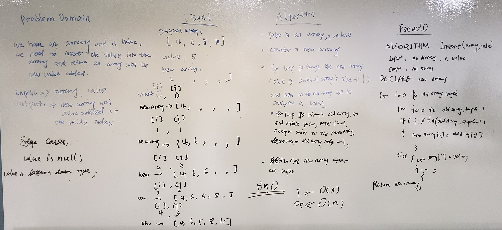

# Insert and Shift an Array

## Challenge
Write a method called ArrayInsert which takes in an array and the value to be added. Without utilizing any of the built-in methods available to your language, return an array with the new value added at the middle index.

## Approach & Efficiency
1. Big O Time = O(n) // Big O Space = O(n)
	- Both the time and the space of this algorithm is O(n), as one of the restraints in C# is that arrays have a fixed size. Any changes to the array to result in a brand new array being instantiated.

## Solution

