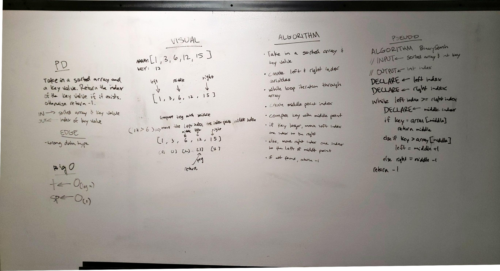

# Array Binary Search

## Challenge
Write a function called BinarySearch which takes in 2 parameters: a sorted array and a search key. Return the index of the array’s element that is equal to the search key, or -1 if the element does not exist.

## Approach & Efficiency
1.  Big O Time = O(log2n) // Big O Space = O(n)

## Solution

