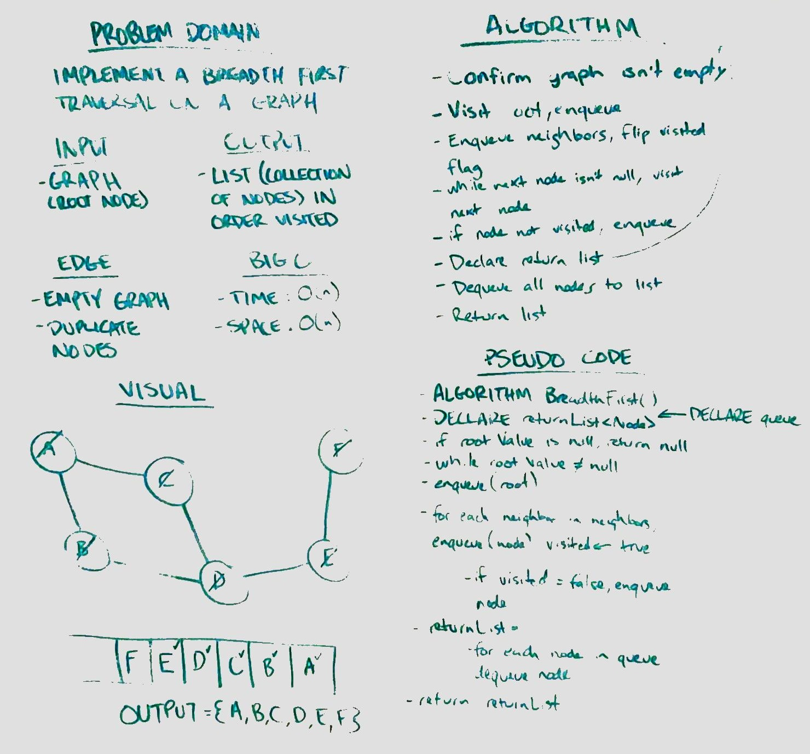

<h1 align="center">Breadth-First Traversal of a Graph</h1>
Implement a breadth-first traversal on a graph.

## Challenge
 - Extend your graph object with a breadth-first traversal method that accepts a starting node.
 - Without utilizing any of the built-in methods available to your language, return a collection of nodes in the order they were visited.
 - Display the collection.

## Approach & Efficiency
 - Time: O(2n) since we have to enqueue the graph nodes and then enqueue them to a list
 - Space: O(n^2) since we have to create a list and a queue

## Solution
