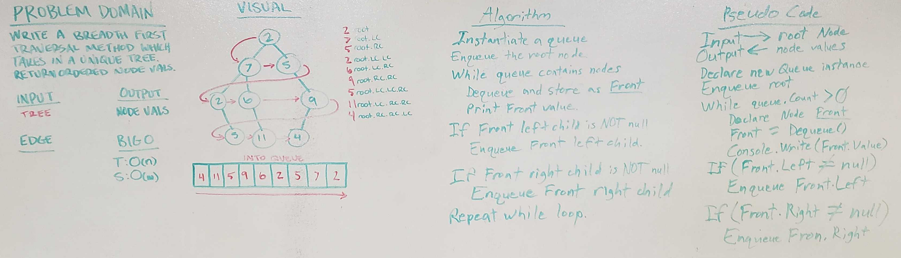

# Breadth-first
Breadth first tree traversal method.

## Challenge
Write a breadth first traversal method which takes a Binary Tree as its unique input. Without utilizing any of the built-in methods available to your language, traverse the input tree using a Breadth-first approach; print every visited node’s value.

## Approach & Efficiency
- Time: O(n)
- Space: O(w)

## Solution
