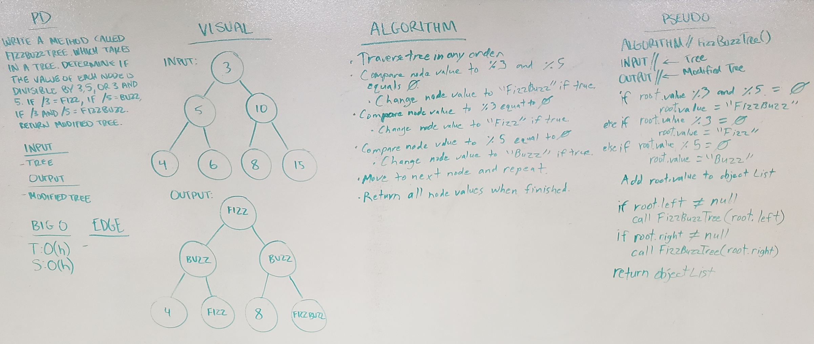

# FizzBuzz Tree
This method traverses a given tree and determines if each node value is divisible by 3, 5, or 3 and 5, then changes the value to "Fizz", "Buzz", or "FizzBuzz", respectively.

## Challenge
Write a method called FizzBuzzTree which takes in a tree. Determine if each node's value is divisible by 3, 5, or 3 and 5.
	- If divisible by 3, change the node's value to "Fizz"
	- If divisible by 5, change the node's value to "Buzz"
	- If divisible by 3, change the node's value to "FizzBuzz"
	- Return augmented tree

## Approach & Efficiency
- Time: O(h)
- Space: O(h)

The FizzBuzzTree method traverses a given binary tree recursively, and compares each node value to the given conditions. Once compared, each value is stored to a list collection before moving to the next node. Once traversal is complete, the list collection is converted to an array then returned.

## Solution

