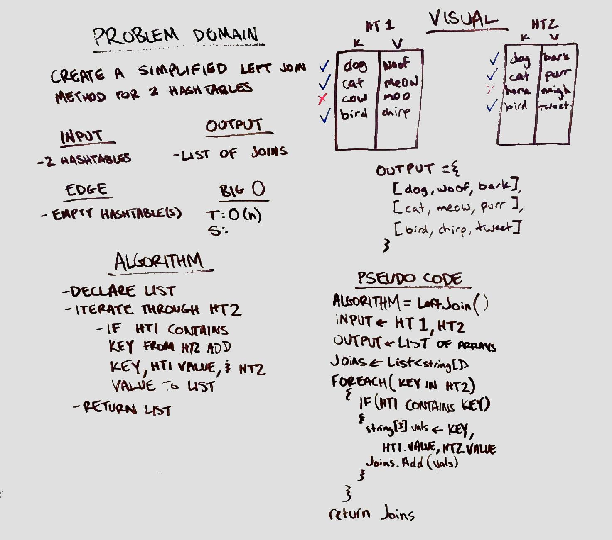

# Hashmap LEFT JOIN
Create a simplified Left Join method.

## Challenge
Write a method which takes in two hashtables as parameters. Without using any built-in functions, find the keys present in both tables. Return a data structure which left joins the key with it's corresponding values from each table.

## Approach & Efficiency
- Time: O(n)
- Space: O(n)

## Solution

