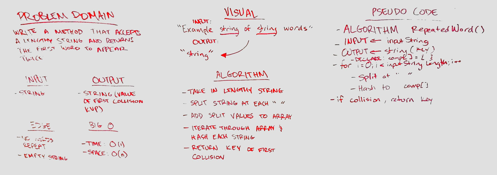

# First repeated word
Find the first repeated word in a book.

## Challenge
- Write a function that accepts a lengthy string parameter.
- Without utilizing any of the built-in library methods available to your language, return the first word to occur more than once in that provided string.

## Approach & Efficiency
- Time: O(1) since we are looking for one key in the hashtable
- Space: O(n) since we have to iterate through the string to split it

## Solution

