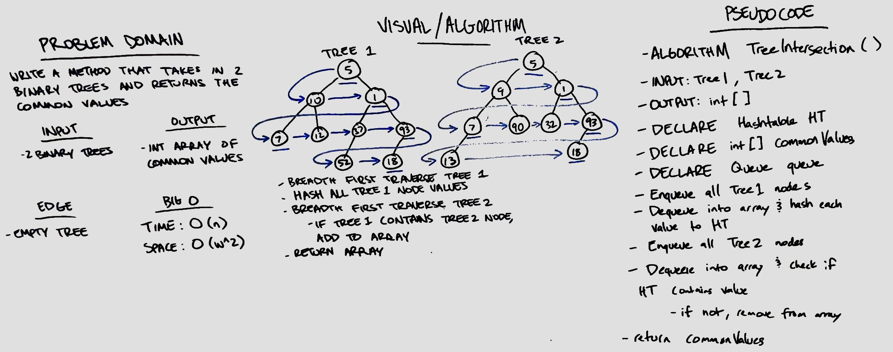

# Intersection of binary trees
Find all of the common node values between two binary trees

## Challenge
Write a method called TreeIntersection that takes two binary trees as parameters. Without utilizing any of the built-in library methods available, return a set of values found in both trees.

## Approach & Efficiency
- Time: O(n)
- Space: O(n^2)

## Solution

