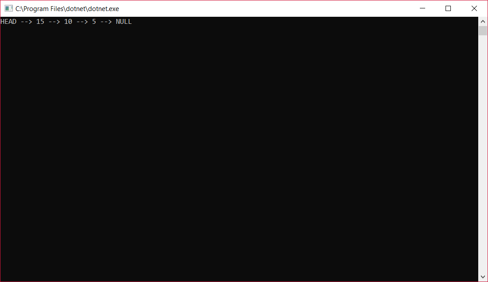

# Linked List

## Data Structure
A Linked List is a linear data structure which consists of a group of nodes in a sequence.

## Approach & Efficiency
1.  Big O Time = O(n) // Big O Space = O(n)

## Demonstration

## Thank you!